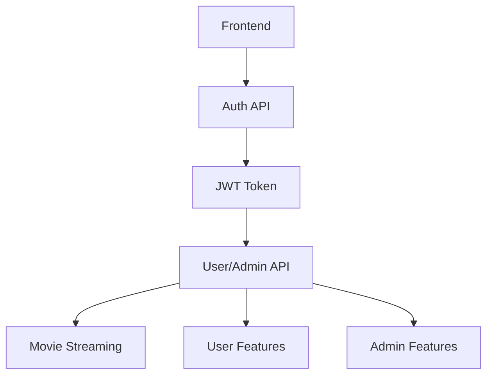

# Bolt Movie Streaming Platform - Backend Services

## 🚀 Quick Overview

### API Services
1. **Auth API** (Port 4000)
   - User authentication & management
   - Email verification
   - JWT token handling

2. **Admin API** (Port 5002)
   - Movie management
   - User management
   - Analytics

3. **User API** (Port 5001)
   - Movie streaming
   - Watchlist
   - History tracking

## 📋 API Details

### Auth API (4000)
```
POST /api/auth/register    - User registration
POST /api/auth/verify     - Email verification
POST /api/auth/login      - User login
POST /api/auth/refresh    - Token refresh
GET  /api/auth/me         - Get user profile
```

### Admin API (5002)
```
POST   /api/movies        - Add new movie
PUT    /api/movies/:id    - Update movie
DELETE /api/movies/:id    - Delete movie
GET    /api/users         - List users
POST   /api/analytics     - Get platform analytics
```

### User API (5001)
```
GET  /api/movies          - List movies
GET  /api/movies/:id      - Get movie details
GET  /api/movies/stream   - Stream movie
POST /api/watchlist      - Manage watchlist
GET  /api/history        - View history
```

## 🎯 Subscription Tiers

### Basic Plan
- 720p streaming quality
- 1 device at a time
- Limited movie library
- Basic features:
  * Watch movies
  * Create watchlist
  * Basic search

### Premium Plan
- 1080p streaming quality
- 2 devices simultaneously
- Full movie library
- Additional features:
  * Download movies
  * Ad-free experience
  * Advanced search
  * Multiple audio tracks
  * Subtitles

### VIP Plan
- 4K streaming quality
- 4 devices simultaneously
- Full movie library + Early access
- All Premium features plus:
  * Offline downloads
  * Priority streaming
  * Custom profiles
  * Family sharing
  * HDR content
  * Dolby Atmos
  * Exclusive content
  * Priority support

## 🔄 API Flow



## 🛠️ Error Handling

Common error patterns:
```
400 - Bad Request
401 - Unauthorized
403 - Forbidden
404 - Not Found
500 - Server Error
```

## 📁 Directory Structure

```
Backend/
├── Auth/               # Authentication Service
├── Admin/              # Admin Management
└── User-Get movies/    # User & Movie Service
```

## 🚦 Health Checks

Each service has a health endpoint:
```
GET /health
```

## 🔐 Environment Setup

Each service requires its own `.env` file. Example:
```
PORT=xxxx
MONGODB_URI=xxx
JWT_SECRET=xxx
```

## 📡 Common Issues

1. **Port Conflicts**
   - Check if ports 4000, 5000, or 5002 are in use
   - Update .env file if needed

2. **MongoDB Connection**
   - Verify MONGODB_URI in .env
   - Check network connectivity

3. **Token Issues**
   - Verify JWT_SECRET is consistent across services
   - Check token expiration times
