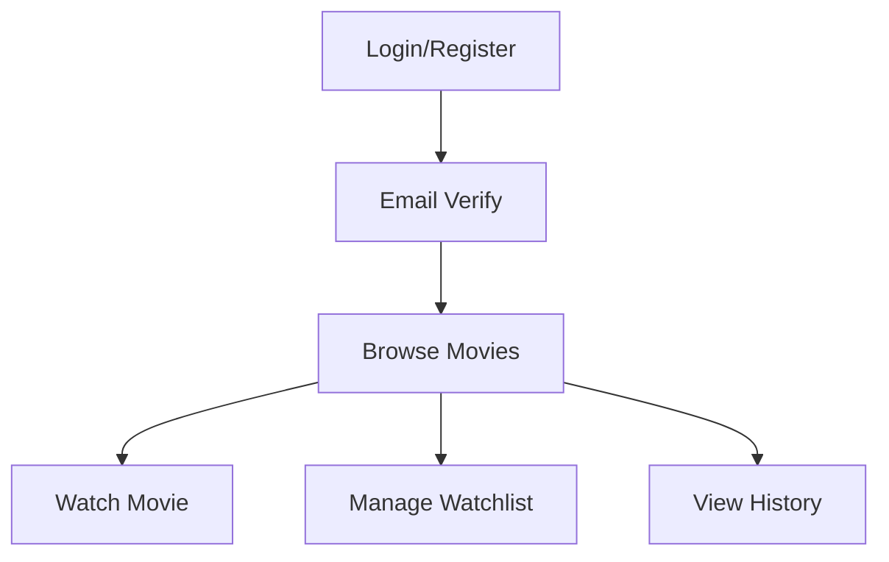

# Bolt Movie Streaming Platform - Frontend

## 🎬 Quick Overview

Modern React + TypeScript streaming platform with advanced features and beautiful UI.

## 🎯 Key Features

### 🔐 Authentication
- Multi-step registration
- Email verification
- JWT token management
- Role-based access

### 🎥 Movie Experience
- Browse movies with filters
- Advanced search
- Video player with quality selection
- Progress tracking
- Watchlist management

### 👤 User Features
- Profile management
- Watch history
- Custom preferences
- Multiple device support

### 🛠️ Admin Panel
- Movie management
- User management
- Analytics dashboard
- Content approval system

## 📁 Project Structure

```
Frontend/
├── src/
│   ├── components/     # Reusable components
│   ├── pages/         # Page components
│   ├── contexts/      # React contexts
│   ├── hooks/         # Custom hooks
│   ├── config/        # Configuration
│   └── utils/         # Helper functions
```

## 🎨 Components Overview

### Authentication
```
LoginForm      - User login
RegisterForm   - User registration
VerifyPage     - Email verification
ProtectedRoute - Route protection
```

### Movie Components
```
MovieCard      - Individual movie display
MovieGrid      - Movie collection display
MoviePlayer    - Video player
MoviesPage     - Main movie listing
```

### Admin Components
```
MovieManager   - Movie CRUD operations
UserManager    - User management
Analytics      - Platform analytics
```

## 🔌 API Integration

### API Configuration
```typescript
Auth API   - localhost:4000
Admin API  - localhost:5002
User API   - localhost:5001
```

## 🎨 Theme & Styling

Using Tailwind CSS with custom theme:
```
Primary: #3B82F6
Secondary: #10B981
Error: #EF4444
```

## 📱 Responsive Design

- Mobile First approach
- Breakpoints:
  * sm: 640px
  * md: 768px
  * lg: 1024px
  * xl: 1280px

## 🚀 Getting Started

1. Install dependencies:
   ```bash
   npm install
   ```

2. Start development server:
   ```bash
   npm run dev
   ```

## 🔍 Common Issues

1. **API Connection**
   - Check if backend services are running
   - Verify API ports in config

2. **Authentication**
   - Clear localStorage if token issues
   - Check email verification status

3. **Video Playback**
   - Verify network speed
   - Check video quality settings

## 💡 Tips

1. Use Chrome DevTools for debugging
2. Check Network tab for API issues
3. Use Redux DevTools for state debugging
4. Monitor console for errors

## 🎮 User Interface Flow



## 🔐 Security Features

1. JWT token management
2. Role-based access control
3. Protected routes
4. API request interceptors
5. Error boundaries

## 📈 Performance

1. Lazy loading for routes
2. Image optimization
3. Caching strategies
4. Debounced search
5. Infinite scrolling
